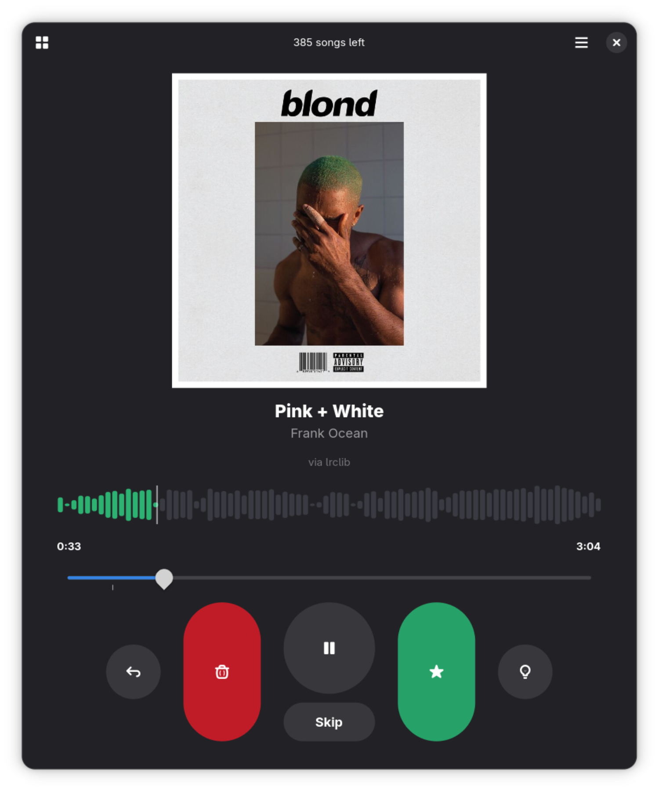

# Sift
**Tinder for your Music Library**

Sift is a keyboard-driven music library weeder for GNOME. It plays the chorus of each track in your library and lets you quickly decide to keep it, trash it, or skip it — all without lifting your hands from the keyboard.

<table><tr>
<td width="50%"><video src="https://github.com/user-attachments/assets/53bd9c31-d558-41bb-acb2-5e566f5dbdd7" controls width="100%"></video></td>
<td width="50%"></td>
</tr></table>

---

## How it works

Sift scans a folder you choose, then plays the most recognisable part of each track — the chorus — so you can make a fast judgement call:

| Key | Action |
|-----|--------|
| `→` | Keep the song |
| `←` | Trash it |
| `↓` | Skip for now |
| `Space` | Play / pause |
| `Ctrl+Z` | Undo last action |
| `I` | View song info |
| `Ctrl+D` | Open library dashboard |

Chorus detection uses [LRCLIB](https://lrclib.net) synced lyrics where available, falling back to librosa RMS energy analysis. Results are shown as a live mel-spectrogram visualiser.

Your kept and trashed songs are saved to a workspace folder (`~/Music/sift-workspace` by default), so your decisions persist across sessions.

---

## Features

- Automatic chorus detection via LRCLIB synced lyrics or librosa energy analysis
- Live mel-spectrogram visualiser with playhead
- Dashboard to review liked and trashed songs, restore from trash, or delete files
- Configurable workspace folder for storing your lists
- Session memory — resumes where you left off
- Full song metadata viewer
- Keyboard-first design — judge an entire library without touching the mouse

---

## Installation

### Option 1 — Flatpak bundle (recommended)

Download `sift.flatpak` from the [latest release](https://github.com/IdleEndeavor/sift_music_sorter/releases/latest) and install it:

```bash
flatpak install sift.flatpak
```

Then launch it from your GNOME app launcher or run:

```bash
flatpak run io.github.IdleEndeavor.Sift
```

To uninstall:

```bash
flatpak uninstall io.github.IdleEndeavor.Sift
```

### Option 2 — Run directly from source

**Dependencies:**

```bash
pip install librosa soundfile mutagen requests send2trash numba --break-system-packages
```

**Install local icons and desktop entry:**

```bash
bash install-local.sh
```

**Run:**

```bash
python3 sift.py
```

---

## Building the Flatpak from source

You'll need `flatpak-builder` and the GNOME Platform/SDK runtime:

```bash
sudo dnf install flatpak-builder
flatpak install flathub org.gnome.Platform//47 org.gnome.Sdk//47
```

Then build and install:

```bash
flatpak-builder --force-clean --install --user build-dir io.github.IdleEndeavor.Sift.json
```

> **Note:** All Python dependency wheels are fetched automatically from PyPI during the build. No manual downloads required.

---

## Workspace

By default Sift stores your liked list, trash list, and session state in:

```
~/Music/sift-workspace/
```

You can change this in **Menu → Preferences → Workspace**. The workspace path itself is saved to `~/.config/sift/config.json`.

---

## Tech stack

- [GTK4](https://gtk.org) + [Libadwaita](https://gnome.pages.gitlab.gnome.org/libadwaita) — UI
- [GStreamer](https://gstreamer.freedesktop.org) — audio playback
- [librosa](https://librosa.org) — audio analysis and mel-spectrogram
- [LRCLIB](https://lrclib.net) — synced lyrics for chorus detection
- [mutagen](https://mutagen.readthedocs.io) — audio tag reading
- [send2trash](https://github.com/arsenetar/send2trash) — safe file deletion

---

## License

GPL-3.0 — see [LICENSE](LICENSE) for details.
